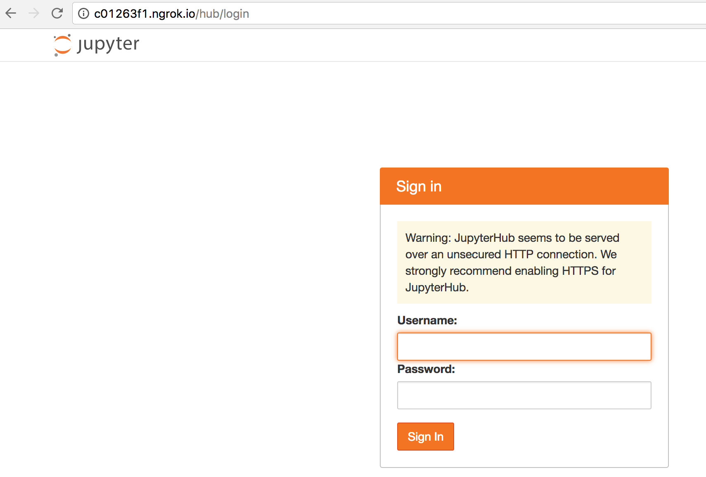

# Run docker image as a server

- start server

```bash
bash run_hub.sh
```

- try

  - Paste "http://127.0.0.1:8000/" to your web browser
  - Login with username='hello' and password=666666

- add new user

Supposed you have a running server
```bash
# login to the docker container "jupyterhub"
docker exec -it jupyterhub bash

# add "new_user" account
useradd -m -d /home/new_user/ -s /bin/bash -G jupyterhub new_user
```

# Run jupyterhub without docker

- setup
```bash
# require conda
source setup_jupyterhub_without_docker.sh
jupyterhub
```

- try

  - Paste "http://127.0.0.1:8000/" to your web browser
  - Login with your username and password (from your account)

# Build docker image (developer)

```bash
docker build -t ambermd/amber-jupyterhub .
```

# Tips
- Use [ngrok](https://ngrok.com/) for port forwarding (safely?)

Disclaimer: I am not really sure if this is secure.

- Server
    - Download and unzip `ngrok` from https://ngrok.com/
    - Run `./ngrok http 8000` (You will see something like `http://xxxx.ngrok.io -> localhost:8000`)
    - In another terminal, run: jupyterhub
- User
    - Open web browser and paste `http://xxxx.ngrok.io` (replace `xxxx` by actual address)

User will see


    
# Useful link

- [https://developer.rackspace.com/blog/deploying-jupyterhub-for-education/](https://developer.rackspace.com/blog/deploying-jupyterhub-for-education/)
